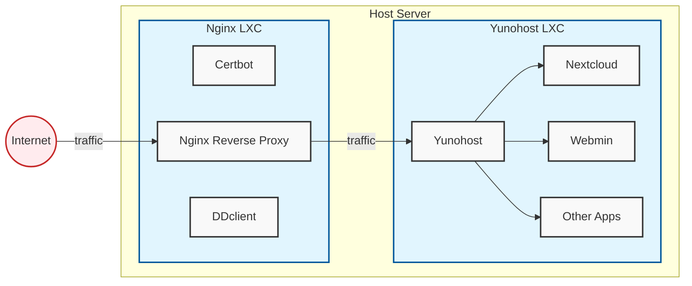
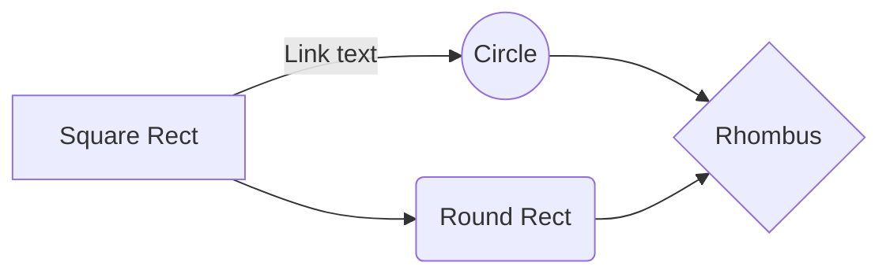

# Yunohost in LXC behind a reverse proxy

Considering you probably sought this out yourself I will not bore you with long explanations about what reverse proxies and LXCs are. If you don't know what an LXC or a reverse proxy is, please don't proceed and seek another tutorial. 

Essentially this is the setup:



All of the following is done on an installation of Ubuntu 24.04, though it is likely to work on other Debian derivative distros too. This assumes the server/computer is hooked up to the internet via an ethernet cable, and that you own a domain name.

Also before we begin, read through the whole tutorial BEFORE you start copy pasting commands some rando on the internet (me) said to run with sudo privileges. 


## Getting the host set up

Assuming you have snap installed, otherwise you'll have to get it installed first.
First of we will first install the lxd package:

`sudo snap install lxd`

`sudo lxd init`

Leave everything on the default settings. Press enter until it asks you if you want Yaml lxd init preseed. Then type yes and enter.

It should look like this: 

```
config: {}
networks:
- config:
    ipv4.address: auto
    ipv6.address: auto
  description: ""
  name: lxdbr0
  type: ""
  project: default
storage_pools:
- config:
    size: 30GiB
  description: ""
  name: default
  driver: zfs
storage_volumes: []
profiles:
- config: {}
  description: ""
  devices:
    eth0:
      name: eth0
      network: lxdbr0
      type: nic
    root:
      path: /
      pool: default
      type: disk
  name: default
projects: []
cluster: null

```

Considering you're going to be setting up a home cloud solution, we should make room for more storage than the default 30Gb.
And be generous with storage in this step, it's not very fun to have to go back to tinker in a shell only to screw up your data. (speaking from experience here)

We will set up the Nginx reverse proxy at the same time as yunohost due to many similar steps.

Create a storage pools for the containers, we will the btrfs storage driver because the docs for it look less daunting than zfs while still allowing for some practical features: 

`sudo lxc storage create ynh-pool btrfs size=200GiB`

Change the size to whatever you need (remember, be generous).

`sudo lxc storage create nginx-proxy-pool btrfs size=5GiB`

The proxy barely needs any storage, its mostly just for logs.

Make the lxcs

The yunohost container must be Debian 11.6, upgrading to 12 or higher will completely incapacitate your yunohost.

`sudo lxc init images:debian/11 yunohost -s ynh-pool`

This is config that some say you have to enable, though I have not investigated this myself:

`sudo lxc config set yunohost security.nesting true`

You may also have to set this config too: 

`lxc config set yunohost security.privileged true`

We will use the latest (at this time) LTS ubuntu release for the proxy.

`sudo lxc init ubuntu:24.04 nginx-proxy -s nginx-proxy-pool`

The nginx proxy doesn't need very much storage so the default is very much adequate. 

We will now choose which internal IP address we will give to Yunohost and the proxy.
To do that we have to first know the range:

`sudo lxc network show lxdbr0`

Look for where is says `ipv4.address: 10.x.x.1/24`
The number where the `x`'s are will vary and that is why we have to know them. 
Make note of this number.

We will assign internal ip addresses to yunohost and the proxy for, now the proxy we will have an address ending with 5 and for yunohost the address will end 10. For example if in the `ipv4.address` field it says `10.255.255.1` we will assign the ip `10.255.255.5` to the proxy. 

`sudo lxc config device override nginx-proxy eth0 ipv4.address=10.242.92.5`

`sudo lxc config device override nginx-proxy eth0 ipv4.address=10.242.92.5`

Now that we have the containers set up enough that we can work with them lets turn them on: 

`sudo lxc start yunohost`

`sudo lxc start nginx-proxy` 

And by doing `sudo lxc list` you will notice that the containers now have the internal ip addresses which you assigned to them!

Now the first container we will setup is the yunohost container, because to test the proxy we need something we can work with. 
Open a shell inside the container:

`sudo lxc exec yunohost bash`

The container does not have curl installed, so lets go through the standard steps: 

`apt update && apt upgrade && apt install curl -y`

And now we will install yunohost in the container: 

`curl https://install.yunohost.org | bash`

Choose yes when it asks you to overwrite configurations for various programs. 
It will take some time so go get a coffee while it does its thing.

Once it is done it will spit out two ip addresses, one internal which begins with 10 and another which is your public ip address. 
You can't access your server via your public ip just yet, but you can connect to your internal ip with a browser on the host.

Now we will get to the good stuff, this is where many headaches were had and probably the part that you are having trouble with.

Do `exit` to get back to the host shell.

Lets open up some ports so that we can access what we need to in the proxy container: 
Replace <nginx-container-ip> with the internal ip of the nginx-proxy (`sudo lxc list`).
10.133.143.5
`sudo lxc config device add nginx-proxy http proxy listen=tcp:0.0.0.0:80 connect=tcp:<nginx-container-ip>:80`
`sudo lxc config device add nginx-proxy https proxy listen=tcp:0.0.0.0:443 connect=tcp:<nginx-container-ip>:443`
`sudo lxc config device add nginx-proxy imaps proxy listen=tcp:0.0.0.0:993 connect=tcp:<nginx-container-ip>:993`
`sudo lxc config device add nginx-proxy smtp proxy listen=tcp:0.0.0.0:25 connect=tcp:<nginx-container-ip>:25`
`sudo lxc config device add nginx-proxy submission proxy listen=tcp:0.0.0.0:587 connect=tcp:<nginx-container-ip>:587`
`sudo lxc config device add nginx-proxy xmpp_client proxy listen=tcp:0.0.0.0:5222 connect=tcp:<nginx-container-ip>:5222`
`sudo lxc config device add nginx-proxy xmpp_server proxy listen=tcp:0.0.0.0:5269 connect=tcp:<nginx-container-ip>:5269`

I intentionally excluded port 22, which is for ssh access. I do not recommend that you funnel it to the container.

Open a shell inside the proxy container: 

`sudo lxc exec nginx-proxy bash`

And now go through the motions to install nginx: 

`apt update && apt upgrade -y && apt install nginx -y`

Here we will first add a config for the reverse proxy: 

Open the config file: `nano /etc/nginx/sites-available/reverse-proxy.conf`

And edit this config file before you paste it in:

```  
server {
    server_name tamiz.dev *.tamiz.dev;
    listen 80;

    location / {
        proxy_pass https://10.242.92.10;
        proxy_redirect off;
        proxy_set_header Host $host;
        proxy_set_header X-Real-IP $remote_addr;
        proxy_set_header X-Forwarded-For $proxy_add_x_forwarded_for;
        proxy_set_header X-Forwarded-Proto $scheme;
        client_max_body_size 50M;
    }

    access_log /var/log/nginx/yunohost_access.log;
    error_log /var/log/nginx/yunohost_error.log error;
}
```
Save and exit the file, ctrl s and ctrl x.

Now to enable the proxy we will:

`ln -s /etc/nginx/sites-available/reverse-proxy.conf /etc/nginx/sites-enabled/`

Do `nginx -t` to test if the config is valid.

We will also disable the default site:

`rm /etc/nginx/sites-enabled/default`

Pass the rest of the ports to yunohost. 

Open a config file:

`nano /etc/nginx/stream-proxy.conf`

And edit it: 

```
stream {
    server {
        listen 25;
        proxy_pass <yunohost-container-ip>:25;
    }
    server {
        listen 587;
        proxy_pass <yunohost-container-ip>:587;
    }
    server {
        listen 993;
        proxy_pass <yunohost-container-ip>:993;
    }
    server {
        listen 5222;
        proxy_pass <yunohost-container-ip>:5222;
    }
    server {
        listen 5269;
        proxy_pass <yunohost-container-ip>:5269;
    }
}
```
Edit the nginx config to include the config we just made: 

`nano /etc/nginx/nginx.conf`

Put this below where it says `include`:

`include /etc/nginx/stream-proxy.conf;`

Save and exit. 

Now install this package: 

`apt install libnginx-mod-stream`

Were almost done with configurations, the last thing we need to do is to get certificates so we don't get warnings all the time. 

To do so we are going to use a package called `certbot` which is provided by letsencrypt. 

Since in the config we are including wildcard domains we are going to have to use an extension to certbot to prove that we have full control of the domain.

Certbot will also edit some nginx configs automatically.

Depending on your domain name registrar the next few steps will differ slightly.
Since I have porkbun as my registrar I will now install the `certbot-dns-porkbun` plugin for certbot.
To find out which package corresponds to your registrar you can google "certbot <your-registrar> pip".
You will also have to figure out how to get api keys from your registrar yourself.

Consult the certbot docs to be completely sure of what the next steps are: 
https://certbot.eff.org/instructions?ws=nginx&os=ubuntufocal&tab=wildcard


Create a file called `credentials.ini` and add your api keys from your registrar: 

Make and open a text file with `nano`: 

`nano credentials.ini`

And add your api keys:

```
dns_porkbun_key=<your-porkbun-api-key>
dns_porkbun_secret=<your-porkbun-api-secret>
```

Save and exit.

Elevate the needed permissions to access the credentials: 

`chmod 600 credentials.ini`

Installing certbot according to the eff docs.

snap install --classic certbot

ln -s /snap/bin/certbot /usr/bin/certbot

snap set certbot trust-plugin-with-root=ok

snap install certbot-dns-<your-registrar>

snap install --candidate certbot-dns-porkbun

certbot plugins

if your plugin doesn't show up there: 

snap connect certbot:plugin certbot-dns-porkbun

certbot plugins again

If it still doesn't work you're on your buddy.

If it works: 


```
certbot -i nginx \
  --agree-tos \
  --email <your-email-address> \
  --preferred-challenges dns \
  --authenticator dns-porkbun \
  --dns-porkbun-credentials credentials.ini \
  --dns-porkbun-propagation-seconds 60 \
  -d "yourdomain.com"\
  -d "*.yourdomain.com"
```


When certbot asks you which server blocks you'd like to modify just click enter.


Now go setup your yunohost credentials via your domain and enjoy!

https://documentation.ubuntu.com/lxd/en/latest/howto/storage_pools/ 


<<<<<
We will now proceed with installing the porkbun plugin and certbot in a venv.

Make a venv called certbot:

`python3 -m venv certbot`

Activate it:

`source certbot/bin/activate`
`pip install certbot certbot-dns-porkbun certbot-nginx`


The following command will also differ depending on your registrar.
There will be instructions in the PyPI docs.
Now run a command to get the certs for the domain:
>>>>>

certbot -i nginx \
  --agree-tos \
  --email eabudy8@protonmail.com\
  --preferred-challenges dns \
  --authenticator dns-porkbun \
  --dns-porkbun-credentials credentials.ini \
  --dns-porkbun-propagation-seconds 60 \
  -d tamiz.dev -d *.tamiz.dev


server {
    server_name tamiz.dev *.tamiz.dev;


    listen 443 ssl; # managed by Certbot
    ssl_certificate /etc/letsencrypt/live/tamiz.dev/fullchain.pem; # managed by Certbot
    ssl_certificate_key /etc/letsencrypt/live/tamiz.dev/privkey.pem; # managed by Certbot
    include /etc/letsencrypt/options-ssl-nginx.conf; # managed by Certbot
    ssl_dhparam /etc/letsencrypt/ssl-dhparams.pem; # managed by Certbot


##########
    location / {
        proxy_pass https://10.242.92.10; 
        proxy_redirect off;
        
        proxy_set_header Host $host;
        proxy_set_header X-Real-IP $remote_addr;
        proxy_set_header X-Forwarded-For $proxy_add_x_forwarded_for;
        proxy_set_header X-Forwarded-Proto $scheme;

        client_max_body_size 50M;
    }

    access_log /var/log/nginx/yunohost_access.log;
    error_log /var/log/nginx/yunohost_error.log error;

    ssl_certificate /etc/letsencrypt/live/tamiz.dev/fullchain.pem; # managed by Certbot
    ssl_certificate_key /etc/letsencrypt/live/tamiz.dev/privkey.pem; # managed by Certbot
}
server {
    if ($host = tamiz.dev) {
        return 301 https://$host$request_uri;
    } # managed by Certbot


    listen 80;
    server_name tamiz.dev *.tamiz.dev;
    return 404; # managed by Certbot


}
# Installing Yunohost into an LXC behind an Nginx reverse proxy (also in an lxc)

Considering you probably sought this out yourself I will not bore you with long explanations about what a reverse proxy is. If you don't know what an LXC or a reverse proxy is, please don't proceed and seek another tutorial. 

All of the following is done on an installation of Ubuntu 24.04, though it is likely to work on other Debian derivative distros too. This assumes the server/computer is hooked up to the internet via an ethernet cable, and that you own a domain name.

Also before we begin, read through the whole tutorial BEFORE you start copy pasting commands some rando on the internet (me) said to run with sudo privileges. 


## Getting the host set up

Assuming you have snap installed, otherwise you'll have to get it installed first.
First of we will first install the lxd package:

`sudo snap install lxd`

`sudo lxd init`

Leave everything on the default settings. Press enter until it asks you if you want Yaml lxd init preseed. Then type yes and enter.

It should look like this: 

```
config: {}
networks:
- config:
    ipv4.address: auto
    ipv6.address: auto
  description: ""
  name: lxdbr0
  type: ""
  project: default
storage_pools:
- config:
    size: 30GiB
  description: ""
  name: default
  driver: zfs
storage_volumes: []
profiles:
- config: {}
  description: ""
  devices:
    eth0:
      name: eth0
      network: lxdbr0
      type: nic
    root:
      path: /
      pool: default
      type: disk
  name: default
projects: []
cluster: null

```

Considering you're going to be setting up a home cloud solution, we should make room for more storage than the default 30Gb.
And be generous with storage in this step, it's not very fun to have to go back to tinker in a shell only to screw up your data. (speaking from experience here)

We will set up the Nginx reverse proxy at the same time as yunohost due to many similar steps.

Create a storage pools for the containers, we will the btrfs storage driver because the docs for it look less daunting than zfs while still allowing for some practical features: 

`sudo lxc storage create ynh-pool btrfs size=200GiB`

Change the size to whatever you need (remember, be generous).

`sudo lxc storage create nginx-proxy-pool btrfs size=5GiB`

The proxy barely needs any storage, its mostly just for logs.

Make the lxcs

The yunohost container must be Debian 11.6, upgrading to 12 or higher will completely incapacitate your yunohost.

`sudo lxc init images:debian/11 yunohost -s ynh-pool`

This is config that some say you have to enable, though I have not investigated this myself:

`sudo lxc config set yunohost security.nesting true`

You may also have to set this config too: 

`lxc config set yunohost security.privileged true`

We will use the latest (at this time) LTS ubuntu release for the proxy.

`sudo lxc init ubuntu:24.04 nginx-proxy -s nginx-proxy-pool`

The nginx proxy doesn't need very much storage so the default is very much adequate. 

We will now choose which internal IP address we will give to Yunohost and the proxy.
To do that we have to first know the range:

`sudo lxc network show lxdbr0`

Look for where is says `ipv4.address: 10.x.x.1/24`
The number where the `x`'s are will vary and that is why we have to know them. 
Make note of this number.

We will assign internal ip addresses to yunohost and the proxy for, now the proxy we will have an address ending with 5 and for yunohost the address will end 10. For example if in the `ipv4.address` field it says `10.255.255.1` we will assign the ip `10.255.255.5` to the proxy. 

`sudo lxc config device override nginx-proxy eth0 ipv4.address=10.242.92.5`

`sudo lxc config device override nginx-proxy eth0 ipv4.address=10.242.92.5`

Now that we have the containers set up enough that we can work with them lets turn them on: 

`sudo lxc start yunohost`

`sudo lxc start nginx-proxy` 

And by doing `sudo lxc list` you will notice that the containers now have the internal ip addresses which you assigned to them!

Now the first container we will setup is the yunohost container, because to test the proxy we need something we can work with. 
Open a shell inside the container:

`sudo lxc exec yunohost bash`

The container does not have curl installed, so lets go through the standard steps: 

`apt update && apt upgrade && apt install curl -y`

And now we will install yunohost in the container: 

`curl https://install.yunohost.org | bash`

Choose yes when it asks you to overwrite configurations for various programs. 
It will take some time so go get a coffee while it does its thing.

Once it is done it will spit out two ip addresses, one internal which begins with 10 and another which is your public ip address. 
You can't access your server via your public ip just yet, but you can connect to your internal ip with a browser on the host.

Now we will get to the good stuff, this is where many headaches were had and probably the part that you are having trouble with.

Do `exit` to get back to the host shell.

Lets open up some ports so that we can access what we need to in the proxy container: 
Replace <nginx-container-ip> with the internal ip of the nginx-proxy (`sudo lxc list`).
10.133.143.5
`sudo lxc config device add nginx-proxy http proxy listen=tcp:0.0.0.0:80 connect=tcp:<nginx-container-ip>:80`
`sudo lxc config device add nginx-proxy https proxy listen=tcp:0.0.0.0:443 connect=tcp:<nginx-container-ip>:443`
`sudo lxc config device add nginx-proxy imaps proxy listen=tcp:0.0.0.0:993 connect=tcp:<nginx-container-ip>:993`
`sudo lxc config device add nginx-proxy smtp proxy listen=tcp:0.0.0.0:25 connect=tcp:<nginx-container-ip>:25`
`sudo lxc config device add nginx-proxy submission proxy listen=tcp:0.0.0.0:587 connect=tcp:<nginx-container-ip>:587`
`sudo lxc config device add nginx-proxy xmpp_client proxy listen=tcp:0.0.0.0:5222 connect=tcp:<nginx-container-ip>:5222`
`sudo lxc config device add nginx-proxy xmpp_server proxy listen=tcp:0.0.0.0:5269 connect=tcp:<nginx-container-ip>:5269`

I intentionally excluded port 22, which is for ssh access. I do not recommend that you funnel it to the container.

Open a shell inside the proxy container: 

`sudo lxc exec nginx-proxy bash`

And now go through the motions to install nginx: 

`apt update && apt upgrade -y && apt install nginx -y`

Here we will first add a config for the reverse proxy: 

Open the config file: `nano /etc/nginx/sites-available/reverse-proxy.conf`

And edit this config file before you paste it in:

```  
server {
    server_name tamiz.dev *.tamiz.dev;
    listen 80;

    location / {
        proxy_pass https://10.242.92.10;
        proxy_redirect off;
        proxy_set_header Host $host;
        proxy_set_header X-Real-IP $remote_addr;
        proxy_set_header X-Forwarded-For $proxy_add_x_forwarded_for;
        proxy_set_header X-Forwarded-Proto $scheme;
        client_max_body_size 50M;
    }

    access_log /var/log/nginx/yunohost_access.log;
    error_log /var/log/nginx/yunohost_error.log error;
}
```
Save and exit the file, ctrl s and ctrl x.

Now to enable the proxy we will:

`ln -s /etc/nginx/sites-available/reverse-proxy.conf /etc/nginx/sites-enabled/`

Do `nginx -t` to test if the config is valid.

We will also disable the default site:

`rm /etc/nginx/sites-enabled/default`

Pass the rest of the ports to yunohost. 

Open a config file:

`nano /etc/nginx/stream-proxy.conf`

And edit it: 

```
stream {
    server {
        listen 25;
        proxy_pass <yunohost-container-ip>:25;
    }
    server {
        listen 587;
        proxy_pass <yunohost-container-ip>:587;
    }
    server {
        listen 993;
        proxy_pass <yunohost-container-ip>:993;
    }
    server {
        listen 5222;
        proxy_pass <yunohost-container-ip>:5222;
    }
    server {
        listen 5269;
        proxy_pass <yunohost-container-ip>:5269;
    }
}
```
Edit the nginx config to include the config we just made: 

`nano /etc/nginx/nginx.conf`

Put this below where it says `include`:

`include /etc/nginx/stream-proxy.conf;`

Save and exit. 

Now install this package: 

`apt install libnginx-mod-stream`

Were almost done with configurations, the last thing we need to do is to get certificates so we don't get warnings all the time. 

To do so we are going to use a package called `certbot` which is provided by letsencrypt. 

Since in the config we are including wildcard domains we are going to have to use an extension to certbot to prove that we have full control of the domain.

Certbot will also edit some nginx configs automatically.

Depending on your domain name registrar the next few steps will differ slightly.
Since I have porkbun as my registrar I will now install the `certbot-dns-porkbun` plugin for certbot.
To find out which package corresponds to your registrar you can google "certbot <your-registrar> pip".
You will also have to figure out how to get api keys from your registrar yourself.

Consult the certbot docs to be completely sure of what the next steps are: 
https://certbot.eff.org/instructions?ws=nginx&os=ubuntufocal&tab=wildcard


Create a file called `credentials.ini` and add your api keys from your registrar: 

Make and open a text file with `nano`: 

`nano credentials.ini`

And add your api keys:

```
dns_porkbun_key=<your-porkbun-api-key>
dns_porkbun_secret=<your-porkbun-api-secret>
```

Save and exit.

Elevate the needed permissions to access the credentials: 

`chmod 600 credentials.ini`

Installing certbot according to the eff docs.

snap install --classic certbot

ln -s /snap/bin/certbot /usr/bin/certbot

snap set certbot trust-plugin-with-root=ok

snap install certbot-dns-<your-registrar>

snap install --candidate certbot-dns-porkbun

certbot plugins

if your plugin doesn't show up there: 

snap connect certbot:plugin certbot-dns-porkbun

certbot plugins again

If it still doesn't work you're on your own big man.

If it works: 


```
certbot -i nginx \
  --agree-tos \
  --email <your-email-address> \
  --preferred-challenges dns \
  --authenticator dns-porkbun \
  --dns-porkbun-credentials credentials.ini \
  --dns-porkbun-propagation-seconds 60 \
  -d "yourdomain.com"\
  -d "*.yourdomain.com"
```


When certbot asks you which server blocks you'd like to modify just click enter.


Now go setup your yunohost credentials via your domain and enjoy!

https://documentation.ubuntu.com/lxd/en/latest/howto/storage_pools/ 


<<<<<
We will now proceed with installing the porkbun plugin and certbot in a venv.

Make a venv called certbot:

`python3 -m venv certbot`

Activate it:

`source certbot/bin/activate`
`pip install certbot certbot-dns-porkbun certbot-nginx`


The following command will also differ depending on your registrar.
There will be instructions in the PyPI docs.
Now run a command to get the certs for the domain:
>>>>>

certbot -i nginx \
  --agree-tos \
  --email eabudy8@protonmail.com\
  --preferred-challenges dns \
  --authenticator dns-porkbun \
  --dns-porkbun-credentials credentials.ini \
  --dns-porkbun-propagation-seconds 60 \
  -d tamiz.dev -d *.tamiz.dev


# Welcome to StackEdit!

Hi! I'm your first Markdown file in **StackEdit**. If you want to learn about StackEdit, you can read me. If you want to play with Markdown, you can edit me. Once you have finished with me, you can create new files by opening the **file explorer** on the left corner of the navigation bar.


# Files

StackEdit stores your files in your browser, which means all your files are automatically saved locally and are accessible **offline!**

## Create files and folders

The file explorer is accessible using the button in left corner of the navigation bar. You can create a new file by clicking the **New file** button in the file explorer. You can also create folders by clicking the **New folder** button.

## Switch to another file

All your files and folders are presented as a tree in the file explorer. You can switch from one to another by clicking a file in the tree.

## Rename a file

You can rename the current file by clicking the file name in the navigation bar or by clicking the **Rename** button in the file explorer.

## Delete a file

You can delete the current file by clicking the **Remove** button in the file explorer. The file will be moved into the **Trash** folder and automatically deleted after 7 days of inactivity.

## Export a file

You can export the current file by clicking **Export to disk** in the menu. You can choose to export the file as plain Markdown, as HTML using a Handlebars template or as a PDF.


# Synchronization

Synchronization is one of the biggest features of StackEdit. It enables you to synchronize any file in your workspace with other files stored in your **Google Drive**, your **Dropbox** and your **GitHub** accounts. This allows you to keep writing on other devices, collaborate with people you share the file with, integrate easily into your workflow... The synchronization mechanism takes place every minute in the background, downloading, merging, and uploading file modifications.

There are two types of synchronization and they can complement each other:

- The workspace synchronization will sync all your files, folders and settings automatically. This will allow you to fetch your workspace on any other device.
	> To start syncing your workspace, just sign in with Google in the menu.

- The file synchronization will keep one file of the workspace synced with one or multiple files in **Google Drive**, **Dropbox** or **GitHub**.
	> Before starting to sync files, you must link an account in the **Synchronize** sub-menu.

## Open a file

You can open a file from **Google Drive**, **Dropbox** or **GitHub** by opening the **Synchronize** sub-menu and clicking **Open from**. Once opened in the workspace, any modification in the file will be automatically synced.

## Save a file

You can save any file of the workspace to **Google Drive**, **Dropbox** or **GitHub** by opening the **Synchronize** sub-menu and clicking **Save on**. Even if a file in the workspace is already synced, you can save it to another location. StackEdit can sync one file with multiple locations and accounts.

## Synchronize a file

Once your file is linked to a synchronized location, StackEdit will periodically synchronize it by downloading/uploading any modification. A merge will be performed if necessary and conflicts will be resolved.

If you just have modified your file and you want to force syncing, click the **Synchronize now** button in the navigation bar.

> **Note:** The **Synchronize now** button is disabled if you have no file to synchronize.

## Manage file synchronization

Since one file can be synced with multiple locations, you can list and manage synchronized locations by clicking **File synchronization** in the **Synchronize** sub-menu. This allows you to list and remove synchronized locations that are linked to your file.


# Publication

Publishing in StackEdit makes it simple for you to publish online your files. Once you're happy with a file, you can publish it to different hosting platforms like **Blogger**, **Dropbox**, **Gist**, **GitHub**, **Google Drive**, **WordPress** and **Zendesk**. With [Handlebars templates](http://handlebarsjs.com/), you have full control over what you export.

> Before starting to publish, you must link an account in the **Publish** sub-menu.

## Publish a File

You can publish your file by opening the **Publish** sub-menu and by clicking **Publish to**. For some locations, you can choose between the following formats:

- Markdown: publish the Markdown text on a website that can interpret it (**GitHub** for instance),
- HTML: publish the file converted to HTML via a Handlebars template (on a blog for example).

## Update a publication

After publishing, StackEdit keeps your file linked to that publication which makes it easy for you to re-publish it. Once you have modified your file and you want to update your publication, click on the **Publish now** button in the navigation bar.

> **Note:** The **Publish now** button is disabled if your file has not been published yet.

## Manage file publication

Since one file can be published to multiple locations, you can list and manage publish locations by clicking **File publication** in the **Publish** sub-menu. This allows you to list and remove publication locations that are linked to your file.


# Markdown extensions

StackEdit extends the standard Markdown syntax by adding extra **Markdown extensions**, providing you with some nice features.

> **ProTip:** You can disable any **Markdown extension** in the **File properties** dialog.


## SmartyPants

SmartyPants converts ASCII punctuation characters into "smart" typographic punctuation HTML entities. For example:

|                |ASCII                          |HTML                         |
|----------------|-------------------------------|-----------------------------|
|Single backticks|`'Isn't this fun?'`            |'Isn't this fun?'            |
|Quotes          |`"Isn't this fun?"`            |"Isn't this fun?"            |
|Dashes          |`-- is en-dash, --- is em-dash`|-- is en-dash, --- is em-dash|


## KaTeX

You can render LaTeX mathematical expressions using [KaTeX](https://khan.github.io/KaTeX/):

The *Gamma function* satisfying $\Gamma(n) = (n-1)!\quad\forall n\in\mathbb N$ is via the Euler integral

$$
\Gamma(z) = \int_0^\infty t^{z-1}e^{-t}dt\,.
$$

> You can find more information about **LaTeX** mathematical expressions [here](http://meta.math.stackexchange.com/questions/5020/mathjax-basic-tutorial-and-quick-reference).


## UML diagrams

You can render UML diagrams using [Mermaid](https://mermaidjs.github.io/). For example, this will produce a sequence diagram:


And this will produce a flow chart:


