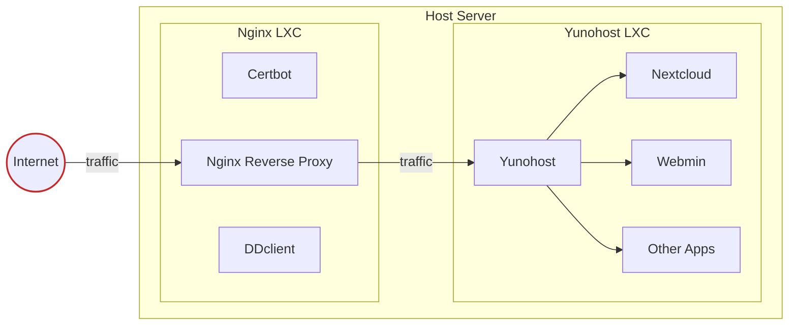

# Installing Yunohost into an LXC Behind an Nginx Reverse Proxy (Also in an LXC)

Considering you probably sought this out yourself, I will not bore you with long explanations about what a reverse proxy is. If you don't know what an LXC or a reverse proxy is, please don't proceed and seek another tutorial.

Essentially this is the setup:



Prerequisites:
- Host with Ubuntu 24.04 (or other Debian based distro)
- Ethernet connection
- A domain name that you own
- Enough sense to read the whole guide before pasting commands from the internet with sudo privileges.

If you for whatever reason have to use wireless, it is totally possible, but figuring out what you have to change is on you.

## Table of Contents

1. [Getting the Host Set Up](#getting-the-host-set-up)
2. [Setting Up the LXC Containers](#setting-up-the-lxc-containers)
3. [Configuring Yunohost Container](#configuring-yunohost-container)
4. [Setting Up the Nginx Reverse Proxy](#setting-up-the-nginx-reverse-proxy)
5. [Installing and Configuring Certbot](#installing-and-configuring-certbot)
6. [Installing ddclient](#installing-ddclient)

## Getting the Host Set Up

Assuming you have snap installed. Otherwise, you'll have to get it installed first.

First, we will install the `lxd` package:

```sh
sudo snap install lxd
```

Initialize LXD:

```sh
sudo lxd init
```

Leave everything on the default settings. Press enter until it asks you if you want YAML LXD init preseed. Then type yes and enter.

It should look like this:

```yaml
config: {}
networks:
- config:
    ipv4.address: auto
    ipv6.address: auto
  description: ""
  name: lxdbr0
  type: ""
  project: default
storage_pools:
- config:
    size: 30GiB
  description: ""
  name: default
  driver: zfs
storage_volumes: []
profiles:
- config: {}
  description: ""
  devices:
    eth0:
      name: eth0
      network: lxdbr0
      type: nic
    root:
      path: /
      pool: default
      type: disk
  name: default
projects: []
cluster: null
```

Considering you're going to be setting up a home cloud solution, we should make room for more storage than the default 30GiB. Be generous with storage in this step; it's not very fun to have to go back to tinker in a shell only to lose your data (speaking from experience here).

We will set up the Nginx reverse proxy at the same time as Yunohost as they share most steps.

Create storage pools for the containers. We will use the `btrfs` storage driver because the [docs](https://documentation.ubuntu.com/lxd/en/latest/howto/storage_pools/) for it look less daunting than `zfs` while still allowing for some practical features:

```sh
sudo lxc storage create ynh-pool btrfs size=<size>GiB
```

Change the size to whatever you need.

```sh
sudo lxc storage create nginx-proxy-pool btrfs size=5GiB
```

The proxy barely needs any storage; it's mostly just for logs.

## Setting Up the LXC Containers

The Yunohost container must remain on Debian 11.6. Upgrading to 12 or higher will completely incapacitate your Yunohost.

```sh
sudo lxc init images:debian/11 yunohost -s ynh-pool
```

Enable necessary configurations for the Yunohost container:

```sh
sudo lxc config set yunohost security.nesting true
sudo lxc config set yunohost security.privileged true
```

We will use the latest (at this time) LTS Ubuntu release for the proxy.

```sh
sudo lxc init ubuntu:24.04 nginx-proxy -s nginx-proxy-pool
```

The Nginx proxy doesn't need very much storage, so the default is very much adequate.

We will now choose which internal IP address we will give to Yunohost and the proxy. To do that, we have to first know the range:

```sh
sudo lxc network show lxdbr0
```

Look for where it says `ipv4.address: 10.x.x.1/24`. The number where the `x`s are will vary, and that is why we have to know them. Make note of this number.

We will assign internal IP addresses to Yunohost and the proxy. For now, the proxy will have an address ending with 5, and for Yunohost, the address will end with 10. For example, if in the `ipv4.address` field it says `10.255.255.1`, we will assign the IP `10.255.255.5` to the proxy.

```sh
sudo lxc config device override yunohost eth0 ipv4.address=10.x.x.10
sudo lxc config device override nginx-proxy eth0 ipv4.address=10.x.x.5
```

Now that we have the containers set up enough that we can work with them, let's turn them on:

```sh
sudo lxc start yunohost
sudo lxc start nginx-proxy
```

By doing `sudo lxc list`, you will notice that the containers now have the internal IP addresses which you assigned to them.

## Configuring Yunohost Container

Now the first container we will set up is the Yunohost container because to test the proxy, we need something we can work with. Open a shell inside the container:

```sh
sudo lxc exec yunohost bash
```

The container does not have curl installed, so let's go through the standard steps:

```sh
apt update && apt upgrade -y && apt install curl -y
```

And now we will install Yunohost in the container:

```sh
curl https://install.yunohost.org | bash
```

Choose yes when it asks you to overwrite configurations for various programs. It will take some time, so go get a coffee while it does its thing.

Once it is done, it will spit out two IP addresses: one internal, which begins with 10, and another which is your public IP address. You can't access your server via your public IP just yet, but you can connect to your internal IP with a browser on the host.

Now we will get to the good stuff. This is where many headaches were had and probably the part that you are having trouble with.

Do `exit` to get back to the host shell.

## Setting Up the Nginx Reverse Proxy

Let's open up some ports so that we can access what we need to in the proxy container. Replace `<nginx-container-ip>` with the internal IP of the nginx-proxy (`sudo lxc list`).

```sh
sudo lxc config device add nginx-proxy http proxy listen=tcp:0.0.0.0:80 connect=tcp:<nginx-container-ip>:80
sudo lxc config device add nginx-proxy https proxy listen=tcp:0.0.0.0:443 connect=tcp:<nginx-container-ip>:443
sudo lxc config device add nginx-proxy imaps proxy listen=tcp:0.0.0.0:993 connect=tcp:<nginx-container-ip>:993
sudo lxc config device add nginx-proxy smtp proxy listen=tcp:0.0.0.0:25 connect=tcp:<nginx-container-ip>:25
sudo lxc config device add nginx-proxy submission proxy listen=tcp:0.0.0.0:587 connect=tcp:<nginx-container-ip>:587
sudo lxc config device add nginx-proxy xmpp_client proxy listen=tcp:0.0.0.0:5222 connect=tcp:<nginx-container-ip>:5222
sudo lxc config device add nginx-proxy xmpp_server proxy listen=tcp:0.0.0.0:5269 connect=tcp:<nginx-container-ip>:5269
```

I intentionally excluded port 22, which is for SSH access. I do not recommend that you funnel it to the container.

Open a shell inside the proxy container:

```sh
sudo lxc exec nginx-proxy bash
```

And install nginx:

```sh
apt update && apt upgrade -y && apt install nginx -y
```

Here we will first add a config for the reverse proxy:

Open the config file:

```sh
nano /etc/nginx/sites-available/reverse-proxy.conf
```

And edit this config file before you paste it in:

```nginx
server {
    server_name yourdomain.com *.yourdomain.com;
    listen 80;

    location / {
        proxy_pass https://<yunohost-container-ip>;
        proxy_redirect off;
        proxy_set_header Host $host;
        proxy_set_header X-Real-IP $remote_addr;
        proxy_set_header X-Forwarded-For $proxy_add_x_forwarded_for;
        proxy_set_header X-Forwarded-Proto $scheme;
        client_max_body_size 50M;
    }

    access_log /var/log/nginx/yunohost_access.log;
    error_log /var/log/nginx/yunohost_error.log error;
}
```

Save and exit the file with `Ctrl + S` and `Ctrl + X`.

Now to enable the proxy, we will:
```sh
ln -s /etc/nginx/sites-available/reverse-proxy.conf /etc/nginx/sites-enabled/
```

Do `nginx -t` to test if the config is valid.

We will also disable the default site:

```sh
rm /etc/nginx/sites-enabled/default
```

To pass the rest of the ports to Yunohost open a config file:

```sh
nano /etc/nginx/stream-proxy.conf
```

And edit it:

```nginx
stream {
    server {
        listen 25;
        proxy_pass <yunohost-container-ip>:25;
    }
    server {
        listen 587;
        proxy_pass <yunohost-container-ip>:587;
    }
    server {
        listen 993;
        proxy_pass <yunohost-container-ip>:993;
    }
    server {
        listen 5222;
        proxy_pass <yunohost-container-ip>:5222;
    }
    server {
        listen 5269;
        proxy_pass <yunohost-container-ip>:5269;
    }
}
```

Edit the nginx config to include the config we just made:

```sh
nano /etc/nginx/nginx.conf
```

Put this below the line that begins with `include`:

```nginx
include /etc/nginx/stream-proxy.conf;
```

Save and exit.

Now install this package:

```sh
apt install libnginx-mod-stream -y
```

Test again:

```sh
nginx -t
```

We are almost done with configurations. The last thing we need to do is to get the certificates so we don't get warnings all the time.

## Installing and Configuring Certbot

To do so, we are going to use a package called `certbot`, which is provided by Let's Encrypt.

Since in the config we are including wildcard domains, we are going to have to use an extension to Certbot to prove that we have full control of the domain.

Certbot will also edit some Nginx configs automatically.

Depending on your domain name registrar, the next few steps will differ slightly. Since I have Porkbun as my registrar, I will now install the `certbot-dns-porkbun` plugin for certbot. To find out which package corresponds to your registrar, you can google "certbot <your-registrar> pip". You will also have to figure out how to get API keys from your registrar yourself.

Consult the Certbot docs to be completely sure of what the next steps are:  
[Certbot Instructions](https://certbot.eff.org/instructions?ws=nginx&os=ubuntufocal&tab=wildcard)

Create a file called `credentials.ini` and add your API keys from your registrar:

Make and open a text file with `nano`:

```sh
nano credentials.ini
```

And add your API keys:

```ini
dns_registrar_key=<your-registrar-api-key>
dns_registrar_secret=<your-registrar-api-secret>
```

Save and exit.

Elevate the needed permissions to access the credentials:

```sh
chmod 600 credentials.ini
```

Install Certbot according to the EFF docs:

```sh
snap install --classic certbot

ln -s /snap/bin/certbot /usr/bin/certbot

snap set certbot trust-plugin-with-root=ok

# You may have to use the --candidate flag
snap install certbot-dns-<your-registrar>

certbot plugins
```

If your plugin doesn't show up there:

```sh
snap connect certbot:plugin certbot-dns-porkbun

certbot plugins
```

If it still doesn't work, you're on your own.

You can try removing Certbot and the extension from your container, and then install them via Pip.

When it works:

```sh
certbot -i nginx \
  --agree-tos \
  --email <your-email-address> \
  --preferred-challenges dns \
  --authenticator dns-your-registrar \
  --dns-your-registrar-credentials credentials.ini \
  --dns-your-registrar-propagation-seconds 60 \
  -d "yourdomain.com"\
  -d "*.yourdomain.com"
```

When certbot asks you which server blocks you'd like to modify, just click enter.

To check that it's working:

```sh
certbot renew --dry-run
```

Navigate to `/etc/systemd/system`:

```sh
cd /etc/systemd/system
ls -l *certbot*
```
If it shows you some processes, that means certbot is running the background.

## Installing ddclient

If you know that you have a static public IP address, you can skip this and just set your IP in the DNS records.

```sh
cd
apt install autoconf -y
wget https://github.com/ddclient/ddclient/archive/refs/tags/v3.11.2.tar.gz
tar xzf v3.11.2.tar.gz
cd ddclient-3.11.2
./autogen
./configure --prefix=/usr --sysconfdir=/etc/ddclient --localstatedir=/var
make
make VERBOSE=1 check
sudo make install
```

Open the ddclient configuration file:

```sh
nano /etc/ddclient/ddclient.conf
```

Edit the file such that the options for your DNS provider are uncommented and valid. This step will differ depending on your provider. If you don't find your DNS provider there, you can try googling for configs. Keep in mind that the domains you update here are dependent on your DNS records.

You also want these lines in the config:

```sh
daemon=300
usev4=webv4
webv4=https://api.ipify.org
```

This will get your IP address via an external source and run ddclient as a background process every 5 minutes, keeping your IP up to date.

### Sidenote

I ran into an issue when using Porkbun where I couldn't update both `mydomain.com` and `*.mydomain.com`. To update `mydomain.com`, I had to add `on-root-domain=yes`, but doing that caused issues with updating `*.mydomain.com`.

To resolve that, I created two configs: `/etc/ddclient/ddclient_root.conf` and `/etc/ddclient/ddclient_wildcard.conf`. One with the options necessary for `mydomain.com`, and the other for `*.mydomain.com`.

In the next step, I created two services instead of one and edited the `.service` files so each one was running ddclient with the `-file` flag pointing to one of the configs.

So you can consider a solution like that if you run into a similar issue. If you do, remember to edit the `pid` in the config and the `.service` file so it's not the same for both processes.

Let's continue with the guide:


Elevate the needed permissions for the config:
```sh
chmod 600 /etc/ddclient/ddclient.conf
```

Check your config for errors:

```sh
ddclient -daemon=0 -debug -verbose -noquiet
```

Create a background service:

```sh
cp sample-etc_systemd.service /etc/systemd/system/ddclient.service
systemctl enable ddclient.service
systemctl start ddclient.service
```

Now do `exit` to get back to your host shell. There you can do:

```sh
sudo lxc config set yunohost boot.autostart true
sudo lxc config set nginx-proxy boot.autostart true
```

Which makes your containers start automatically when you reboot your machine.

Congrats! You got through this guide. Now your certs will automatically renew, your domain will always point to your machine, and you have a working Yunohost container.

Now go set up your Yunohost credentials and enjoy!

(PRs welcome btw)

